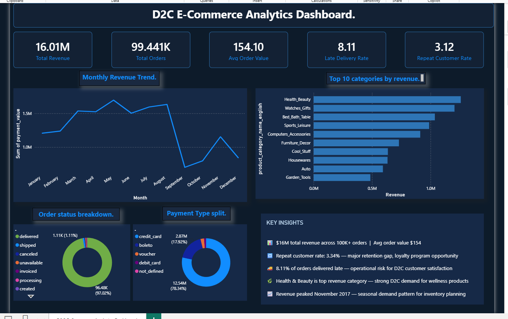

# olist-ecommerce-analysis
D2C E-Commerce Analytics | MySQL + Power BI | 100K+ Orders
# D2C E-Commerce Analytics | MySQL + Power BI

## Project Overview
Analyzed 100,000+ orders from a Brazilian e-commerce platform 
to surface actionable D2C business insights using SQL and Power BI.
Built to mirror the kind of analytics work done at health and 
wellness D2C brands.

---

## Key Findings

| Metric | Result |
|---|---|
| Total Revenue | $16M |
| Total Orders | 99,441 |
| Avg Order Value | $154 |
| Repeat Customer Rate | 3.12% |
| Late Delivery Rate | 8.11% |
| Top Category | Health & Beauty |
| Peak Revenue Month | November 2017 |

---

## Business Insights

- **Retention Gap** — Only 3.12% repeat customer rate signals 
high one-time purchase behaviour. A loyalty program or 
subscription model could significantly improve customer LTV.

- **Delivery Risk** — 8.11% of orders arrived after the promised 
date — a direct risk to customer satisfaction and repeat 
purchases in D2C.

- **Category Demand** — Health & Beauty is the top revenue 
category — strong consumer demand for wellness products 
in e-commerce.

- **Seasonal Pattern** — Revenue peaked in November 2017 — 
useful signal for inventory and marketing budget planning.

---

## SQL Techniques Used

- JOINS (Inner, Left)
- CTEs (Common Table Expressions)
- Window Functions (OVER, PARTITION BY)
- Aggregations (SUM, AVG, COUNT)
- Subqueries
- DATEDIFF for delivery time analysis
- CASE WHEN for conditional logic

---

## Files in This Repository

| File | Description |
|---|---|
| `analysis.sql` | All 11 SQL queries with comments |
| `dashboard.png` | Power BI dashboard screenshot |
| `README.md` | Project documentation |

---

## Tools Used

- **MySQL Workbench** — data storage and SQL analysis
- **Power BI Desktop** — dashboard and visualization
- **Dataset** — Olist Brazilian E-Commerce (Kaggle)

---

## About Me

BBA Graduate | Data Analyst Intern
Skills: SQL · Power BI · Advanced Excel · Google Sheets · MIS Reporting

📧 gaurabidlan0786@gmail.com
🔗 linkedin.com/in/gaurav-b-166a19251
